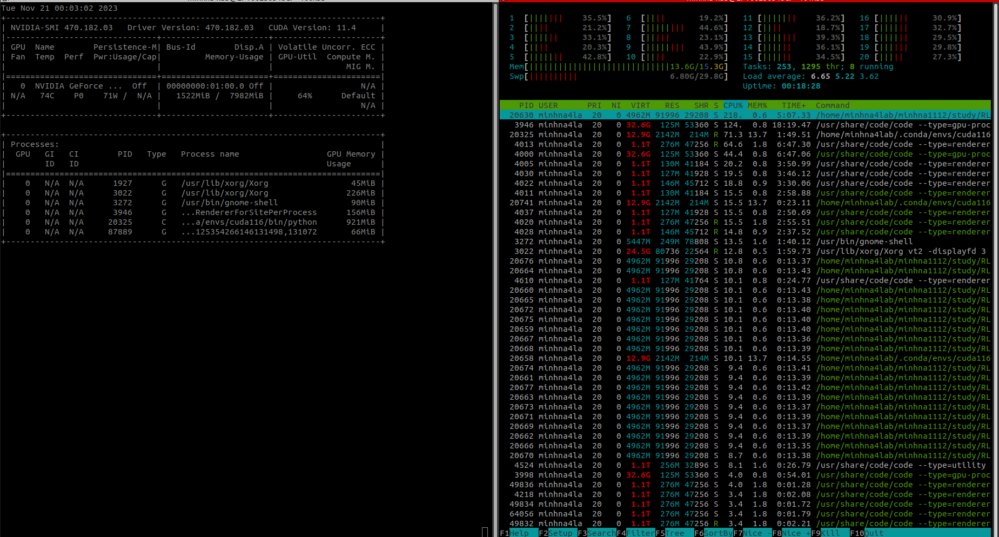
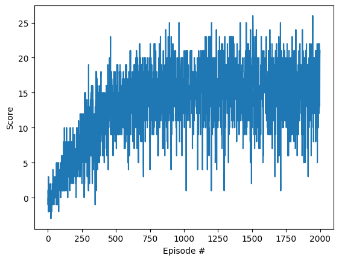

[//]: # (Image References)

[image1]: https://user-images.githubusercontent.com/10624937/42135619-d90f2f28-7d12-11e8-8823-82b970a54d7e.gif "Trained Agent"

# Project 1: Navigation

### Introduction

For this project, you will train an agent to navigate (and collect bananas!) in a large, square world.  

![Trained Agent][image1]

A reward of +1 is provided for collecting a yellow banana, and a reward of -1 is provided for collecting a blue banana.  Thus, the goal of your agent is to collect as many yellow bananas as possible while avoiding blue bananas.  

The state space has 37 dimensions and contains the agent's velocity, along with ray-based perception of objects around agent's forward direction.  Given this information, the agent has to learn how to best select actions.  Four discrete actions are available, corresponding to:
- **`0`** - move forward.
- **`1`** - move backward.
- **`2`** - turn left.
- **`3`** - turn right.

The task is episodic, and in order to solve the environment, your agent must get an average score of +13 over 100 consecutive episodes.

### Quick start
1. Run `python3 -m pip install .`
2. Re-run every cells in `Navigation_solution.ipynb`

### Solution!!!!

1. During setting up environment, I modified a little bit the python dependencies. 
- PyTorch has been uploaded to v2.0.0 with CUDA 11.6, to make used of my RTX 3070Ti Laptop.
- grpcio has been up loaded to v1.53.0

2. During training with the original environent, my Ubuntu machine kept crashing; therefore, I switched to headless version.

3. Policy used:
- To replace the original `uniform` policy in the notebook, I used a DQN agent, combining of 2 Q networks to learn a policy from 2000 episodes.
- The DQN agent is modified from the one used in `Lunar Lander`, but with `state` being a `(37,1)` vector and `action` being a `(4,1)` vector.
- Here is the plot of the scores achieved after each episode.

4. Training the DQN Agent:
- By using 2 Q-Networks at the same time, my GPU consumption is 
- Here is the plot of the scores achieved after each episode.

- My agent reached an avg score of 15.38 after 2000 episodes

5. Future plan:
- Integrate [wandb](https://wandb.ai/) into training pipeline to have better visualization with different hyper-parameters (epsion, hidden units in the Q-nets).
- Dockerization for better setup and packaging.